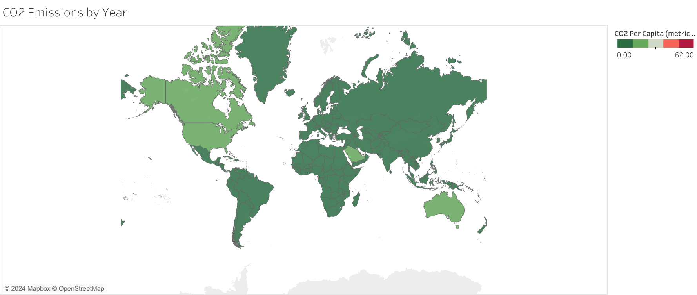

# Linking-Multiple-Datasets-and-Heatmap-of-CO2-Emissions

# Tableau Dashboard: CO2 Emissions by Year

## Overview
This repository contains a Tableau dashboard that visualizes CO2 emissions per capita across the world for a specific year. The dashboard uses a color-coded world map to display CO2 emissions (in metric tons) for each country.

### Features:
- **CO2 Emissions by Year Map**: The world map represents CO2 emissions per capita, with a gradient color scale from green (lower emissions) to red (higher emissions).
- **Data Insights**: The map helps in identifying countries with the highest CO2 emissions, which can be useful for environmental analysis and policy-making.

## How to View:
To explore the dashboard interactively, download the `.twbx` file and open it using [Tableau Desktop](https://www.tableau.com/products/desktop) or [Tableau Public](https://public.tableau.com/s/). The map allows you to filter CO2 emissions by year and examine the data more closely.

## Dashboard Preview:

## Data:
The data used in this dashboard consists of CO2 emissions per capita (in metric tons) for countries worldwide, allowing users to compare environmental impact across different regions.
